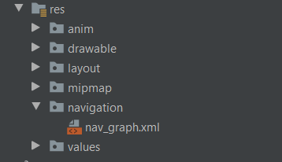

# Android Jetpack - Navigation With Nav - Graph

The navigation component which was introduced to the android jet-pack suite was aimed to remove the complexities behind Fragment navigation. The complexities behind handling the stack of switching fragments leads to unexpected bugs and bloated activity classes.

The following article is here to show how to quickly get setup with Navigation in android.

## Prerequisites

In order to use the navigation component a specific UI design choice needs to be made. Android Navigation promotes the single activity application pattern. This is where the entire application is built on one activity - `MainActivity` this is the core housing of the the application and provides an entry point for all other applications. Every other view must be held within a fragment to make full use of the navigation component.

Android x is an absolute must as the libraries required are only found on the `androidx` namespace.

Kotlin is the preferred language of choice for Jetpack as majority of the features are only presented in Kotlin.

## Gradle Dependencies

To begin with the navigation component the following gradle dependencies are required in your `build.gradle(app)` file.

At the time of writing the latest version is `2.3.0`

```groovy
 // -- Navigation Jet Pack
    def nav_version = "2.3.0"
    implementation "androidx.navigation:navigation-fragment-ktx:$nav_version"
    implementation "androidx.navigation:navigation-ui-ktx:$nav_version"
```

In the `build.gradle(project)` file ensure you have the following:

```groovy
 repositories {
        google()
        jcenter()
    }
```

## MainActivity Setup

The `MainActivity.kt` file is simply a standalone class with no additional setup 

```kotlin
package com.fivegearszerochill.paladins

import android.os.Bundle
import androidx.appcompat.app.AppCompatActivity

class MainActivity : AppCompatActivity() {

    override fun onCreate(savedInstanceState: Bundle?) {
        super.onCreate(savedInstanceState)
        setContentView(R.layout.activity_main)
    }
}
```

However the real setup is within its layout file 

```xml
<?xml version="1.0" encoding="utf-8"?>
<androidx.constraintlayout.widget.ConstraintLayout xmlns:android="http://schemas.android.com/apk/res/android"
    xmlns:app="http://schemas.android.com/apk/res-auto"
    xmlns:tools="http://schemas.android.com/tools"
    android:layout_width="match_parent"
    android:layout_height="match_parent"
    tools:context=".MainActivity">

    <androidx.fragment.app.FragmentContainerView
        android:id="@+id/nav_host_fragment"
        android:name="androidx.navigation.fragment.NavHostFragment"
        android:layout_width="0dp"
        android:layout_height="0dp"
        app:layout_constraintLeft_toLeftOf="parent"
        app:layout_constraintRight_toRightOf="parent"
        app:layout_constraintTop_toTopOf="parent"
        app:layout_constraintBottom_toBottomOf="parent"
        app:defaultNavHost="true"
        app:navGraph="@navigation/nav_graph" />
</androidx.constraintlayout.widget.ConstraintLayout>
```

The only component that can be found in the xml is the `FragmentContainerView` which simply encases the entire activity. It will be the component upon which all fragments are injected and swapped.

Ensure the following:

1. The `android.name` is : `android:name="androidx.navigation.fragment.NavHostFragment"`
2. The component is set to be the default navigation host : ` app:defaultNavHost="true"`
3. A Navigation Graph is attached: `app:navGraph="@navigation/nav_graph"`

Any additional global app UI features may also be added here to ensure for a consistent design theme.

## Creating the Navigation Graph

The Navigation Graph location is shown in the following image 



The following source code shows how to setup the communication between the main fragment and a sub fragment. However this has been made simple using the designer view.
```xml
<?xml version="1.0" encoding="utf-8"?>
<navigation xmlns:android="http://schemas.android.com/apk/res/android"
    xmlns:app="http://schemas.android.com/apk/res-auto"
    xmlns:tools="http://schemas.android.com/tools"
    android:id="@+id/nav_graph"
    app:startDestination="@id/fragmentMain">

    <fragment
        android:id="@+id/fragmentMain"
        android:name="com.fivegearszerochill.presentation.fragments.FragmentMain"
        android:label="fragment_main"
        tools:layout="@layout/fragment_main" >
        
         <argument android:name="user_id"
            android:defaultValue="None"/>
        
        <action
            android:id="@+id/action_fragmentMain_to_profileFragment"
            app:destination="@id/championFragment"
            app:popEnterAnim="@anim/slide_in_left"
            app:popExitAnim="@anim/slide_out_right"
            app:enterAnim="@anim/slide_in_right"
            app:exitAnim="@anim/slide_out_left"/>
    </fragment>

    <fragment
        android:id="@+id/profileFragment"
        android:name="com.fivegearszerochill.presentation.fragments.ProfileFragment"
        android:label="fragment_champion"
        tools:layout="@layout/fragment_champion" />
</navigation>
```

Points to note:

1. The `argument` tag allows us to bundle values between fragments
2. The `action` tag allows us to navigate between fragments
3. 3 the `Anim` attributes allow us to add fragment changing animations 

## How to Transfer between Animations

Within the fragment we implement the `OnClickListener` Interface which provides us with an `OnClick` override. To navigate from that component to another we would set up our function as follows:

```kotlin
private lateinit var navController: NavController
override fun onViewCreated(view: View, savedInstanceState: Bundle?) {
    super.onViewCreated(view, savedInstanceState)
    setOnClickListeners()
    navController = Navigation.findNavController(view)
}
override fun onClick(v: View?) {
    when (v!!.id) {
        R.id.button_one -> {
            val bundle = bundleOf("user_id" to name.text.toString())
            navController.navigate(
                R.id.action_fragmentMain_to_profileFragment,
                bundle
            )
        }
    }
}
```

This allows us to swag from the current fragment to the `profileFragment` through the use of the `NavController`. The above snippet shows how to instantiate the `NavController` as well as use it with a bundle of the `user_id` (which was also defined in the `nav_graph.xml` using the `argument` tag )

---

## Change Log

- [04-10-2020] - Added How to use the Navigation Component With Android Jetpack