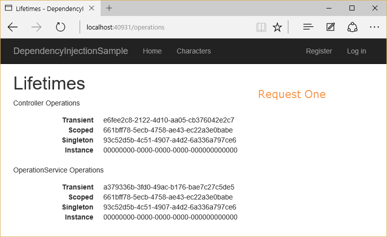
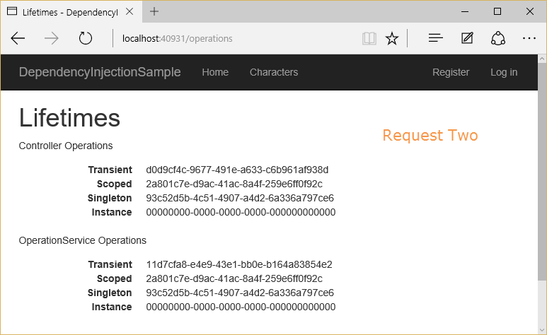

# Difference between the Add Scoped, Transient, Singleton Methods

The `IServiceCollection` which is part of the namespace `Microsoft.Extensions.DependencyInjection` allows for multiple methods to add an implementation and its concrete type to the DI container.

There are three methods of interest in this article, namely:

1. `AddScoped`
2. `AddTransient`
3. `AddSingleton`

For a **<u>TL;DR</u>**

> Transient objects are always different; a new instance is provided to every controller and every service.
>
> Scoped objects are the same within a request, but different across different requests.
>
> Singleton objects are the same for every object and every request.

For a full explanation a <u>stack overflow</u> explanation has been inserted below: [Find Here](https://stackoverflow.com/questions/38138100/addtransient-addscoped-and-addsingleton-services-differences)

To demonstrate the difference between these lifetime and registration options, consider a simple interface that represents one or more tasks as an operation with a unique identifier, `OperationId`. Depending on how we configure the lifetime for this service, the container will provide either the same or different instances of the service to the requesting class. To make it clear which lifetime is being requested, we will create one type per lifetime option:

```cs
using System;

namespace DependencyInjectionSample.Interfaces
{
    public interface IOperation
    {
        Guid OperationId { get; }
    }

    public interface IOperationTransient : IOperation
    {
    }

    public interface IOperationScoped : IOperation
    {
    }

    public interface IOperationSingleton : IOperation
    {
    }

    public interface IOperationSingletonInstance : IOperation
    {
    }
}
```

We implement these interfaces using a single class, `Operation`, that accepts a GUID in its constructor, or uses a new GUID if none is provided:

```cs
using System;
using DependencyInjectionSample.Interfaces;
namespace DependencyInjectionSample.Classes
{
    public class Operation : IOperationTransient, IOperationScoped, IOperationSingleton, IOperationSingletonInstance
    {
        Guid _guid;
        public Operation() : this(Guid.NewGuid())
        {

        }

        public Operation(Guid guid)
        {
            _guid = guid;
        }

        public Guid OperationId => _guid;
    }
}
```

Next, in `ConfigureServices`, each type is added to the container according to its named lifetime:

```cs
services.AddTransient<IOperationTransient, Operation>();
services.AddScoped<IOperationScoped, Operation>();
services.AddSingleton<IOperationSingleton, Operation>();
services.AddSingleton<IOperationSingletonInstance>(new Operation(Guid.Empty));
services.AddTransient<OperationService, OperationService>();
```

Note that the `IOperationSingletonInstance` service is using a specific instance with a known ID of `Guid.Empty`, so it will be clear when this type is in use. We have also registered an `OperationService` that depends on each of the other `Operation` types, so that it will be clear within a request whether this service is getting the same instance as the controller, or a new one, for each operation type. All this service does is expose its dependencies as properties, so they can be displayed in the view.

```cs
using DependencyInjectionSample.Interfaces;

namespace DependencyInjectionSample.Services
{
    public class OperationService
    {
        public IOperationTransient TransientOperation { get; }
        public IOperationScoped ScopedOperation { get; }
        public IOperationSingleton SingletonOperation { get; }
        public IOperationSingletonInstance SingletonInstanceOperation { get; }

        public OperationService(IOperationTransient transientOperation,
            IOperationScoped scopedOperation,
            IOperationSingleton singletonOperation,
            IOperationSingletonInstance instanceOperation)
        {
            TransientOperation = transientOperation;
            ScopedOperation = scopedOperation;
            SingletonOperation = singletonOperation;
            SingletonInstanceOperation = instanceOperation;
        }
    }
}
```

To demonstrate the object lifetimes within and between separate individual requests to the application, the sample includes an `OperationsController` that requests each kind of `IOperation` type as well as an `OperationService`. The `Index` action then displays all of the controller’s and service’s `OperationId` values.

```cs
using DependencyInjectionSample.Interfaces;
using DependencyInjectionSample.Services;
using Microsoft.AspNetCore.Mvc;

namespace DependencyInjectionSample.Controllers
{
    public class OperationsController : Controller
    {
        private readonly OperationService _operationService;
        private readonly IOperationTransient _transientOperation;
        private readonly IOperationScoped _scopedOperation;
        private readonly IOperationSingleton _singletonOperation;
        private readonly IOperationSingletonInstance _singletonInstanceOperation;

        public OperationsController(OperationService operationService,
            IOperationTransient transientOperation,
            IOperationScoped scopedOperation,
            IOperationSingleton singletonOperation,
            IOperationSingletonInstance singletonInstanceOperation)
        {
            _operationService = operationService;
            _transientOperation = transientOperation;
            _scopedOperation = scopedOperation;
            _singletonOperation = singletonOperation;
            _singletonInstanceOperation = singletonInstanceOperation;
        }

        public IActionResult Index()
        {
            // ViewBag contains controller-requested services
            ViewBag.Transient = _transientOperation;
            ViewBag.Scoped = _scopedOperation;
            ViewBag.Singleton = _singletonOperation;
            ViewBag.SingletonInstance = _singletonInstanceOperation;

            // Operation service has its own requested services
            ViewBag.Service = _operationService;
            return View();
        }
    }
}
```

Now two separate requests are made to this controller action:






Observe which of the `OperationId` values varies within a request, and between requests.

- Transient objects are always different; a new instance is provided to every controller and every service.
- Scoped objects are the same within a request, but different across different requests
- Singleton objects are the same for every object and every request (regardless of whether an instance is provided in `ConfigureServices`)

---

## Change Log

- [04-10-2020] - Added Difference between scoped singleton and transient methods