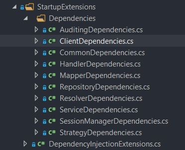

# How To Structure Your Dependencies

It is known that in any project the list of dependencies will grow to a point where managing them becomes quite a task. Cleanup if a file is removed or even restructuring them seems like a task that is simply not worth doing. When starting a project there is a methodology that I like to use to ensure that all dependencies are easily findable as well as simple to add to and manage.

## The Overall File Structure

All dependencies are added to the `IServiceCollection`. This is found in the `Startup.cs` file under the method `ConfigureServices` which is called at runtime. 

Therefore in our web-API project the first step is to add a new folder named `StartupExtensions`. Inside this folder we will have a file named `DependencyInjectionExtensions.cs` and a folder named `Dependencies`. Inside Dependencies the categories will be broken down further.

For each overlying class type (repositories, resolvers, strategies, handlers, factories etc.) there will be a new class for that type.

For example:  



Each Section of the project has its own class holding the dependencies for that particular type. 

Next we will look into writing the dependencies for each type and how this can be trailed back.

## Dependencies of an Overall Type

From the above picture let us take the example of the `RepositoryDependencies.cs` class to see how we might want to further add some dependencies.

```c#

namespace MyApi.Api.StartupExtensions.Dependencies
{
    public static class RepositoryDependencies
    {

        public static IServiceCollection RegisterRepositoryPattern(this IServiceCollection services)
        {
            services
                .RegisterRepositories()
                .RegisterUnitOfWorkManagers();
            return services;
        }
        private static IServiceCollection RegisterRepositories(this IServiceCollection services)
        {
            services.AddScoped<ILanguageRepository, LanguageRepository>();
            services.AddScoped<IQueueRepository, QueueRepository>();
            services.AddScoped<IUserRepository, UserRepositoryRepository>();
            return services;
        }

        private static IServiceCollection RegisterUnitOfWorkManagers(this IServiceCollection services)
        {
            services.AddScoped<IRepositoryResolver, RepositoryResolver>();
            services.AddScoped<IUnitOfWork, UnitOfWork<MyDbContext>>();
            services.AddScoped<IUnitOfWorkManager, UnitOfWorkManager<MyDbContext>>();
            return services;
        }
    }
}
```

From the above it can be seen that to register repositories we need to register all of the repositories but also the unit of work pattern.

To ensure for clean code we will have an overlying method named  `RegisterRepositoryPattern` which will register the two sub categories `RegisterRepositories` and `RegisterUnitOfWorkManagers`. This will ensure that the separation of concern principle is upheld and readability of the code base is kept intact.

## How to Register all Sub Types

Within the `DependencyInjectionExtensions.cs` All of the subtypes are registered in one method as follows:

```c#
using Microsoft.Extensions.DependencyInjection;
using MyApi.Api.StartupExtensions.Dependencies;

namespace MyApi.Api.StartupExtensions
{
    public static class DependencyInjectionExtensions
    {
        public static void RegisterAllDependencies(this IServiceCollection services)
        {
            services
            .RegisterCommon()
            .RegisterClients()
            .RegisterServices()
            .RegisterAuditing()
            .RegisterSessionManager()
            .RegisterRepositoryPattern()
            .RegisterMappers()
            .RegisterStrategies()
            .RegisterResolvers()
            .RegisterHandlers();
        }
    }
}
```

This will consolidate all of the types in one function that can be called in the `Startup.cs` file as follows:

```c#
using MyApi.Api.StartupExtensions;

namespace Paladins.Api
{
    public class Startup
    {
        public void ConfigureServices(IServiceCollection services)
        {
            services.RegisterAllDependencies();  
        }
    }
}
```

 In this manner all dependencies are handled in a way that is clean and easy to manage. 

---

## Change Log

- [04-10-2020] - Added How to Structure Your Dependencies.