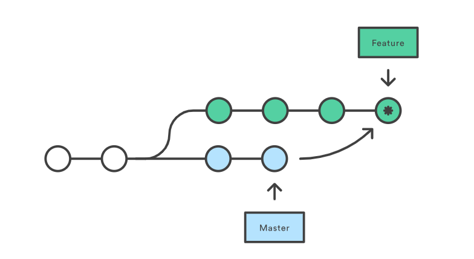
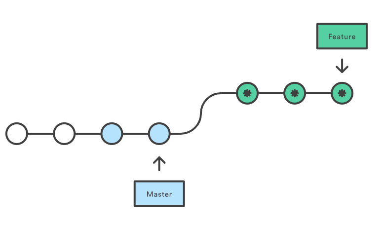

# An introduction to Git merge and rebase: what they are, and how to use them

The common understanding of using Rebase amongst developers is that it should be avoided as it will cause problems. The following will explain how and when to use them.

---

It should be noted that `git merge` and `git rebase` are both designed to integrate multiple branches into one. This is achieved in different ways.

## Git Merge 

Merging is a common practice for developers using version control systems. Whether branches are created for testing, bug fixes, or other reasons, merging commits changes to another location. To be more specific, merging takes the contents of a source branch and integrates them with a target branch. In this process, only the target branch is changed. The source branch history remains the same.



#### **Pros**

- Simple and familiar
- Preserves complete history and chronological order
- Maintains the context of the branch

#### **Cons**

- Commit history can become polluted by lots of merge commits
- Debugging using `git bisect` can become harder

#### **How to do it**

Merge the master branch into the feature branch using the `checkout` and `merge` commands.

```bash
$ git checkout feature
$ git merge master

(or)

$ git merge master feature
```

This will create a new “**Merge commit**” in the feature branch that holds the history of both branches.

---

## Git Rebase

Rebase is another way to integrate changes from one branch to another. Rebase compresses all the changes into a single “patch.” Then it integrates the patch onto the target branch.

Unlike merging, rebasing flattens the history because it transfers the completed work from one branch to another. In the process, unwanted history is eliminated.

> *Rebases are how changes should pass from the top of the hierarchy downwards, and merges are how they flow back upwards*



#### **Pros**

- Streamlines a potentially complex history
- Manipulating a single commit is easy (e.g. reverting them)
- Avoids merge commit “noise” in busy repos with busy branches
- Cleans intermediate commits by making them a single commit, which can be helpful for DevOps teams

#### **Cons**

- Squashing the feature down to a handful of commits can hide the context
- Rebasing public repositories can be dangerous when working as a team
- It’s more work: Using rebase to keep your feature branch updated always
- Rebasing with remote branches requires you to *force push.* The biggest problem people face is they force push but haven’t set git push default. This results in updates to all branches having the same name, both locally and remotely, and that is **dreadful** to deal with.

> *If you rebase incorrectly and unintentionally rewrite the history, it can lead to serious issues, so make sure you know what you are doing!*

#### **How to do it**

Rebase the feature branch onto the master branch using the following commands.

```bash
$ git checkout feature
$ git rebase master
```

This moves the entire feature branch on top of the master branch. It does this by re-writing the project history by creating brand new commits for each commit in the original (feature) branch.

#### **Interactive Rebasing**

This allows altering the commits as they are moved to the new branch. This is more powerful than automated rebase, as it offers complete control over the branch’s commit history. Typically this is used to clean up a messy history before merging a feature branch into master.

```bash
$ git checkout feature
$ git rebase -i master
```

This will open the editor by listing all the commits that are about to be moved.

```bash
pick 22d6d7c Commit message#1
pick 44e8a9b Commit message#2
pick 79f1d2h Commit message#3
```

This defines exactly what the branch will look like after the rebase is performed. By re-ordering the entities, you can make the history look like whatever you want. For example, you can use commands like `fixup`, `squash`, `edit` etc, in place of `pick`.

## Which one to use

So what’s best? What do the experts recommend?

It’s hard to generalize and decide on one or the other, since every team is different. But we have to start somewhere.

Teams need to consider several questions when setting their Git rebase vs. merge policies. Because as it turns out, one workflow strategy is not better than the other. It is dependent on your team.

Consider the level of rebasing and Git competence across your organization. Determine the degree to which you value the simplicity of rebasing as compared to the traceability and history of merging.

Finally, decisions on merging and rebasing should be considered in the context of a clear branching strategy (**Refer** [**this article**](https://medium.freecodecamp.org/adopt-a-git-branching-strategy-ac729ff4f838) to understand more about branching strategy). A successful branching strategy is designed around the organization of your teams.

---

## Source:

This article has been adapted from: [Free Code Camp](https://www.freecodecamp.org/news/an-introduction-to-git-merge-and-rebase-what-they-are-and-how-to-use-them-131b863785f/)


