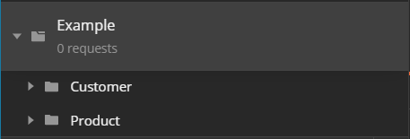

# Collections and how to use them

Postman is a powerful tool. In order to take full advantage of it we need to look at collections. 

## What Are They

From the official Postman documentation collections are defined as follows:

> Postman's collection folders make it easy to keep API requests and elements organized.

## Features that Postman Collections Offer

### API Publication

Allows users to directly download the collection into their own postman instance

### API Monitoring

Allows for customizing postman collections with tests to ensure that the API's are working as expected

### API Documentation

Populates a documentation page with dynamic instructions and machine readable instructions

### Mock Server

Allows to mock out servers to simplify API Design

### Automated Testing

Allows for creating CI/CD test suites to create pipelines so you can test at every push. Provides integration with Travis and Jenkins to create your own custom pipelines.

## How To Structure Your Postman Collection API

To simplify this process let us assume there is an API of the following nature. `api/{controller}/{action}`



For each controller that is in the API we create a subfolder to house all the requests under this sub category. This allows us to add custom scripts for each controller if need be.

## Adding Custom Header Scripts to a Collection.

Let us assume that the for every request in this Collection, it required a header for a phone number.

By clicking the edit option on the collection we can navigate to the `pre-requisite scripts` section of the collection.

This section allows us to add scripts that need to be run before any request. 

```javascript
pm.request.headers.add({key: 'X-Phone-Number' ,value: '000-000-0000' })
```

 The problem now comes in that the phone number value is hard-coded into the script. Lets say we wanted to abstract this to a variable.

By navigating to the variable section of the postman collection. We have the ability to add scoped variables to the this collection. (More about variables [Find Here](./variables.md)) 

Let us add a variable named `PhoneNumber` with the scope of `Collection`.  We can set an initial and current value for the variable. We can now use the variable in our custom script.

```javascript
pm.request.headers.add({key: 'X-Phone-Number' ,value: pm.collectionVariables.get('PhoneNumber')})
```

This will attach a header to every request in this collection.

---

## Change Log

- [04-10-2020] - Added Section For Postman Collections

- [04-10-2020] - Added how to structure collections

- [04-10-2020] - Added how to add request headers to the collection