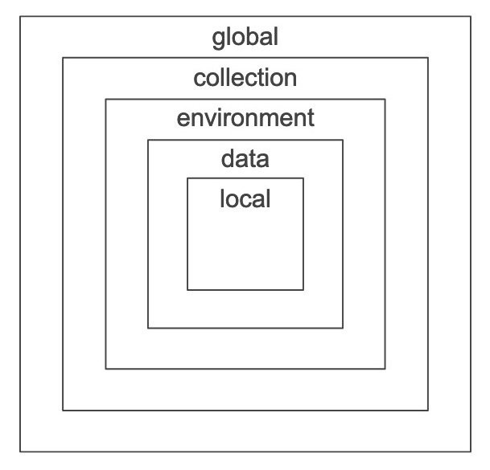
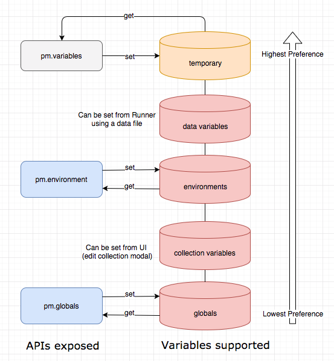

# Variables In Postman

This section is adapted directly from the postman documentation for variables.

## Using variables

Variables allow you to store and reuse values in your requests and scripts. By storing a value in a variable, you can reference it throughout your collections, environments, and requests—and if you need to update the value, you only have to change it in one place. Using variables increases your ability to work efficiently and minimizes the likelihood of error.

## Variables quick start

To try out a variable, use the following steps:

- Click the **Environment quick look** (eye button) in the top right of Postman and click **Edit** next to **Globals**.
- Add a variable named `my_variable` and give it an initial value of `Hello`—click **Save** and close the environment modal.
- Open a new request tab and enter `https://postman-echo.com/get?var={{my_variable}}` as the URL. Hover over the variable name and you'll see the value.
- **Send** the request. In the response, you'll see that Postman sent the variable value to the API. *Try changing the value in the Environment quick look and sending the request again.*

## Understanding variables

A variable is a symbolic representation of data that allows you to access a value without having to enter it manually wherever you need it. This can be useful especially if you are using the same values in multiple places. Variables make your requests more flexible and readable, by abstracting some of the detail away.

## Variable scopes

Postman supports the following variable scopes:

- Global
- Collection
- Environment
- Data
- Local

## Choosing variables

Variable scopes are suited to different tasks in Postman:

- **Global variables** allow you to access data between collections, requests, test scripts, and environments. Global variables are available throughout a [workspace](https://learning.postman.com/docs/collaborating-in-postman/using-workspaces/creating-workspaces/).
  - *Since global variables can create confusion, you should only use them sparingly—for example to quickly test something or when your project is at a very early prototyping stage.*
- **Collection variables** are available throughout the requests in a collection and are independent of environments, so do not change based on the selected environment.
  - *Collection variables are suitable if you are only using a single environment, for example for auth / URL details.*
- **Environment variables** allow you to tailor your processing to different environments, for example local development vs testing or production. Only one environment can be active at a time.
  - *If you only have one environment, using collection variables can be more efficient, however environments allow you to specify [role-based access levels](https://learning.postman.com/docs/sending-requests/managing-environments/#working-with-environments-as-a-team).*
- **Local variables** are temporary, and only accessible in your request scripts. Local variable values are scoped to a single request or collection run, and are no longer available when the run is complete.
  - *Local variables are suitable if you need a value to override all other variable scopes but do not want the value to persist once execution has ended.*
- **Data variables** come from external CSV and JSON files to define data sets you can use when running collections via Newman or the Collection Runner.

---

## Change Log

- [04-10-2020] - Added Section For Postman Variables